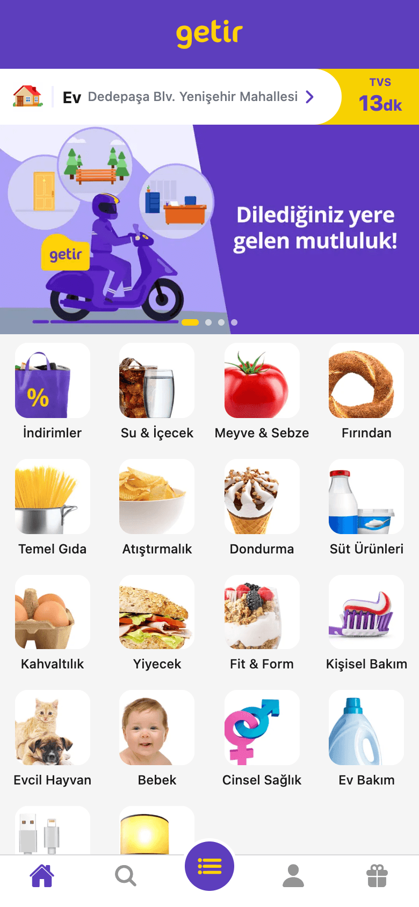
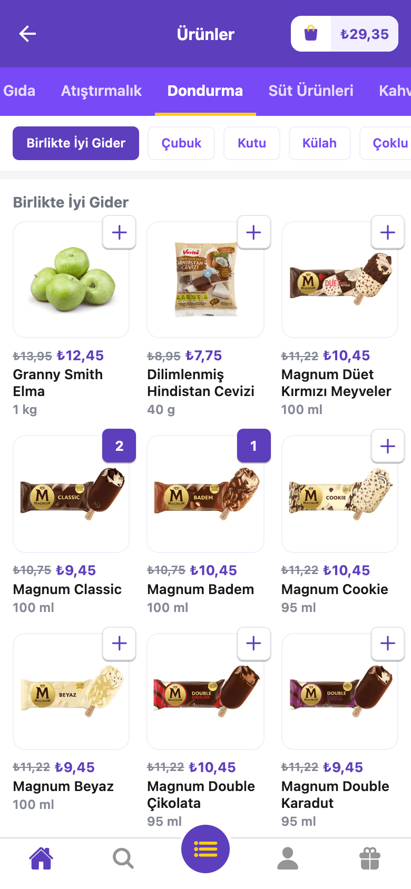
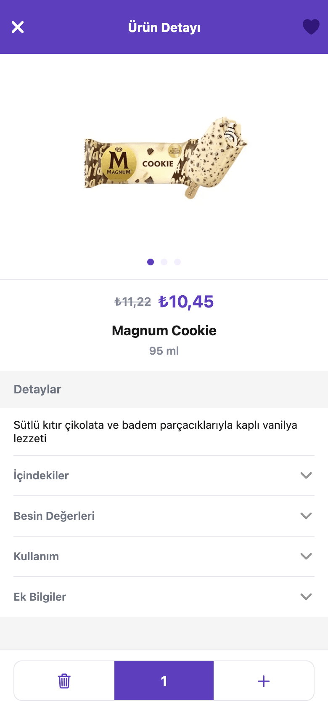
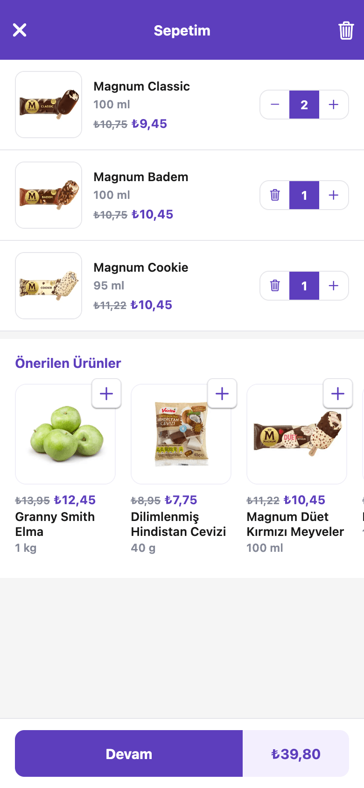
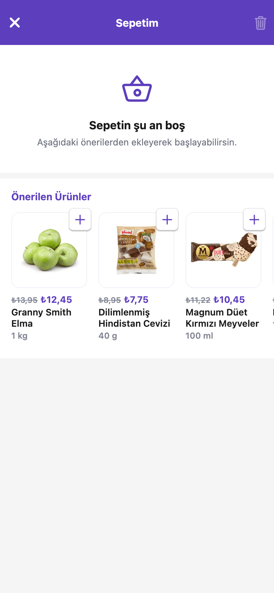

# Getir Clone

Getir mobil uygulamasının arayüzünü ve temel alışveriş akışını örnek alan, React Native ve Expo ile geliştirilmiş bir market uygulaması. iOS, Android ve web'de çalışır.

## Ekran Görüntüleri

| Ana Sayfa | Kategori | Ürün Detayı |
| :---: | :---: | :---: |
|  |  |  |

| Sepet | Boş Sepet |
| :---: | :---: |
|  |  |

## Özellikler

- Kampanya banner'ları ve kategori listesi
- Kategori ve alt kategori filtreleme
- Ürün detayı ve görsel galerisi
- Sepete ekleme, adet artırma/azaltma, sepeti temizleme
- İndirimli fiyat ve sepet toplamı
- `getir://cartScreen/:message` deep link desteği
- Ekranların ihtiyaç anında yüklenmesi (lazy loading)

## Teknolojiler

- [Expo](https://expo.dev) (SDK 54) ve [React Native](https://reactnative.dev) 0.81
- [React](https://react.dev) 19
- [NativeWind](https://www.nativewind.dev) ile [Tailwind CSS](https://tailwindcss.com)
- [Redux Toolkit](https://redux-toolkit.js.org) ve React Redux
- [React Navigation](https://reactnavigation.org) (Native Stack, Bottom Tabs)
- [Expo Image](https://docs.expo.dev/versions/latest/sdk/image/)
- React Native Web

## Kurulum

```bash
git clone https://github.com/<kullanici-adi>/getir-clone.git
cd getir-clone
npm install
```

## Çalıştırma

```bash
npm start          # Expo geliştirme sunucusu
npm run ios        # iOS simülatörü
npm run android    # Android emülatörü
npm run web        # Tarayıcı
npm run build:web  # Web için production build (dist/)
```

Telefonda denemek için [Expo Go](https://expo.dev/go) uygulamasıyla terminaldeki QR kodu okutmanız yeterli.

## Proje Yapısı

```
src/
├── app/                 # Uygulama girişi, store ve navigasyon
├── features/
│   ├── home/            # Ana sayfa, banner, kategori listesi
│   ├── catalog/         # Kategori ve alt kategori filtreleri
│   ├── products/        # Ürün kartı ve ürün detayı
│   └── cart/            # Sepet state'i ve sepet ekranı
└── shared/              # Ortak bileşenler, renk paleti, yardımcılar
public/assets/images/    # Uygulamada kullanılan görseller
```
